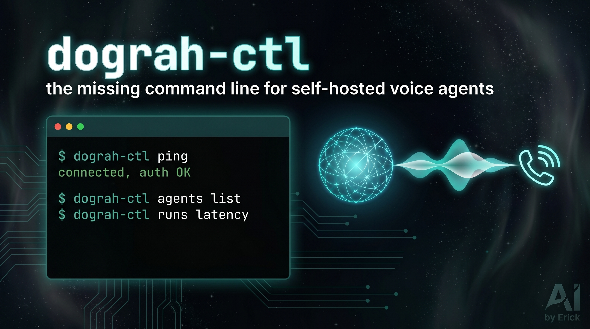

# dograh-ctl



A CLI to run a self-hosted [Dograh](https://github.com/dograh-hq/dograh) voice-agent platform from the terminal: manage agents, telephony, and models, and pull call metrics, without clicking through the dashboard.

## Why this exists

Dograh ships a REST API, generated SDKs, and a dashboard, but no command line. Everything you do to run a voice agent in production (checking which number routes to which agent, reading call latency after a change, flipping a model) means clicking through the UI. `dograh-ctl` is the missing terminal control surface, so the whole voice stack is scriptable, diffable, and automatable.

It is also the foundation for the next step: wrapping these commands as an MCP server so an agent can drive Dograh itself, mid-call.

## Install

```bash
git clone https://github.com/erickcxc/dograh-ctl.git
cd dograh-ctl
pip install -e .
cp .env.example .env
```

Point it at your instance and key (create one in Dograh, under Developers):

```bash
export DOGRAH_BASE_URL=https://your-dograh-host
export DOGRAH_API_KEY=dgr_xxx
```

Auth is the `X-API-Key` header (Bearer returns 401). The key is read from the environment and stays in `.env`, which is gitignored, never in the repo.

## Commands

| Command | What it does |
|---|---|
| `ping` | Verify connectivity and API-key auth against your instance. |
| `agents list` | List the workflows/agents on the instance. |
| `runs list` / `runs latency` | Recent call runs with duration, disposition, and per-run latency. |
| `numbers list` / `numbers assign` | Phone numbers on a telephony config; route a number to an agent. |
| `models set` | Set the model configuration for an agent. |

`ping` ships today; the rest of the command groups are built live on stream. Run `dograh-ctl --help` for the current surface.

## Design

- Thin HTTP client (`httpx`) with the `X-API-Key` header; reads `DOGRAH_BASE_URL` and `DOGRAH_API_KEY` from the environment.
- `typer` plus `rich` for a clean, self-documenting CLI.
- Talks only to your own self-hosted Dograh instance. This is a control layer on top of Dograh; it never vendors or republishes Dograh's code.

## Built live

Designed and built in one hour, live on the AI by Erick stream (Day 8 of the one-hour build challenge), as the engine-first pivot into voice. The next episode wraps these commands as an MCP server so a phone agent can drive Dograh in the middle of a call.

Daily builds: https://www.youtube.com/channel/UCWCXKXvNtNbKPkeK_t5CZlg

I build agentic systems like this for businesses. Reach me through the channel.

## License

MIT
