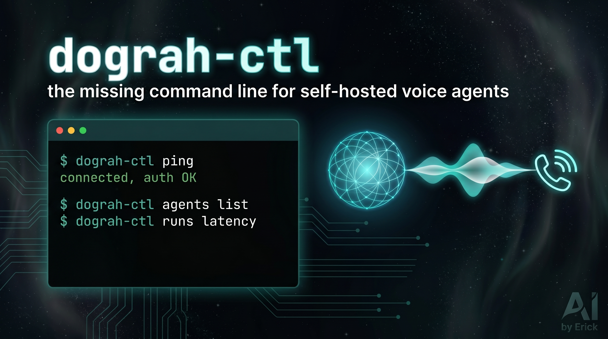
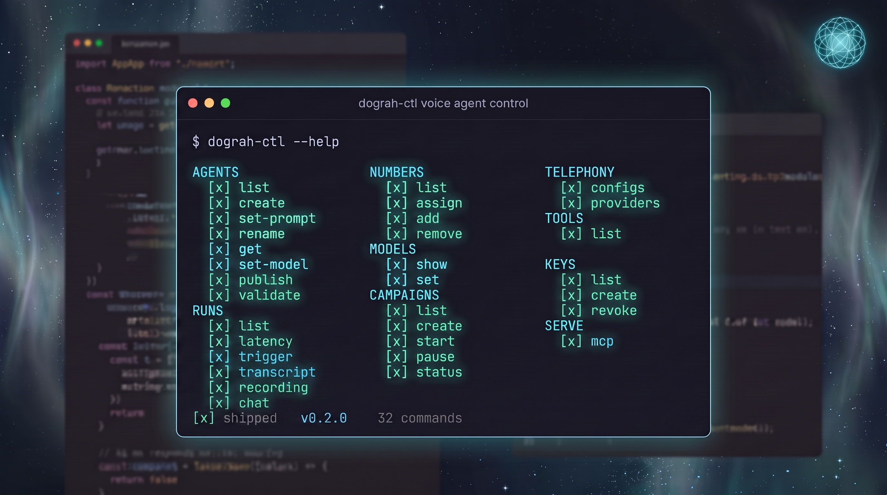

# dograh-ctl



A CLI to run a self-hosted [Dograh](https://github.com/dograh-hq/dograh) voice-agent platform from the terminal: agents, calls, transcripts, numbers, models, campaigns, tools, keys, and an MCP server that exposes all of it to an agent. No dashboard clicking.

## Why this exists

Dograh ships a REST API, generated SDKs, a dashboard, and an MCP server for *building* agents. It does not ship a command line for *running* them. Everything you do to operate a voice agent in production (which number routes where, what the last call cost, flip a model, place a test call, read the transcript) means clicking through the UI. `dograh-ctl` is the missing operations surface: scriptable (`--json` everywhere), diffable, and automatable, and `dograh-ctl serve` hands the same verbs to an agent over MCP.

## Install

No clone needed:

```bash
uv tool install git+https://github.com/erickcxc/dograh-ctl
# or try it without installing
uvx --from git+https://github.com/erickcxc/dograh-ctl dograh-ctl --help
```

From a clone: `pip install -e .` (or `uv sync`). Python 3.10+.

Point it at your instance and key (create a key in Dograh, under Developers):

```bash
export DOGRAH_BASE_URL=https://your-dograh-host
export DOGRAH_API_KEY=dgr_xxx
dograh-ctl ping
```

Auth is the `X-API-Key` header. The key is read from the environment and stays in `.env` (gitignored), never in the repo, never in this tool's output.

## Quick start

```bash
dograh-ctl agents list                                   # what agents exist
dograh-ctl agents get 7                                  # graph summary + model override (masked)
dograh-ctl runs chat 7 -m "hello"                        # talk to an agent, no telephony
dograh-ctl models set --realtime google_realtime/gemini-3.1-flash-live-preview
dograh-ctl agents publish 7                              # edits are drafts until published
dograh-ctl runs trigger 7 --to +13135550100 --yes        # place a real call
dograh-ctl runs transcript 501                           # read it back
dograh-ctl runs latency --json | jq .p95                 # everything is scriptable
```

## Commands

Every command accepts `--json` (raw API payload, for scripts). Every failure is one line on stderr with an exit code: `2` for local configuration problems, `1` for anything the instance refused or could not be reached for. No tracebacks.

| Group | Command | What it does |
|---|---|---|
| | `ping` | Verify connectivity and API-key auth. |
| agents | `list` | List voice agents (workflows). |
| | `get <id>` | Name, status, version, node summary, model override (secrets masked). |
| | `create -u USE_CASE -d DESCRIPTION [--call-type]` | Generate an agent from a use case. |
| | `set-prompt <id> PROMPT` | Replace the prompt on every agentNode (saves a draft). |
| | `rename <id> NAME` | Rename. |
| | `set-model <id> --realtime P/M` / `--llm P/M` | Per-agent model override, read-modify-write (saves a draft). |
| | `publish <id>` | Promote the draft. Production inbound calls use the published version. |
| | `validate <id>` | Validate the draft graph. |
| runs | `list [-n 100]` | Recent call runs: duration, disposition, model. |
| | `latency [-n 100]` | avg/p50/p95/min/max call duration. |
| | `trigger <agent> --to +E164 [--config ID] [--from-id ID] --yes` | Place an outbound call; resolves the run id. |
| | `transcript <run> [--agent ID]` | Print the transcript. |
| | `recording <run> [--out FILE] [--track ...]` | Download the recording. |
| | `chat <agent> [-m TEXT]` | Text session with an agent (no telephony). |
| numbers | `list` | Numbers and which agent each routes to. |
| | `assign +E164 <agent>` | Route a number to an agent. |
| | `add +E164 [--agent ID] [--label] [--config ID]` | Register a number you already own. |
| | `remove +E164 --yes` | Remove from Dograh (does not release it at the carrier). |
| models | `show` | Org model configuration: mode, realtime, llm, tts, stt. |
| | `set --realtime P/M` / `--llm P/M` / `--tts P/M` / `--stt P/M` | Change one block; the server re-merges your stored secrets. |
| campaigns | `list`, `status <id>` | Campaigns and live progress. |
| | `create --name N --agent ID --csv FILE [--config ID] [--max-concurrency N]` | Upload a CSV (`phone_number` column, see `examples/campaign-sample.csv`) and create. |
| | `start <id> --yes`, `pause <id>` | Control. `start` places real calls. |
| telephony | `configs`, `providers` | Telephony configurations; supported providers and their fields. |
| tools | `list [--status] [--category]` | Tools agents can call (HTTP, MCP, transfer, ...). |
| keys | `list [--all]`, `create NAME [--reveal]`, `revoke <id> --yes` | Org API keys. `create` prints the prefix only unless `--reveal`. |
| serve | `serve` | MCP server (stdio) exposing the operations verbs above. |

Buying a number is a carrier action: `twilio phone-numbers:buy:local --country-code US --area-code 313`, then `dograh-ctl numbers add +1313... --agent 7`.

### Safety rails

- Verbs that place calls or cost money (`runs trigger`, `campaigns start`, `numbers remove`, `keys revoke`) ask for confirmation; pass `--yes` in scripts.
- `models set` and `agents set-model` read the current configuration, change one block, and write the whole thing back, so masked secrets are merged by the server, never overwritten with a placeholder.
- Nothing prints a secret. `keys create` shows the prefix; `--reveal` prints the full key once.
- Edits to an agent are drafts. `agents publish` is the step that changes production behaviour.

## Build with Dograh's MCP, operate with dograh-ctl serve

Dograh mounts its own MCP server at `{DOGRAH_BASE_URL}/api/v1/mcp` (Streamable HTTP, same API key). Its tools are for **authoring**: create and save workflows, list node types, search the docs, pull the voice-prompting guide.

`dograh-ctl serve` is the **operations** plane over stdio: list agents, place a call, read a transcript, latency stats, route numbers, flip models, watch a campaign. Point Claude Code (or any MCP client) at both and an agent can build a voice agent, call it, and read what happened.

```json
{ "mcpServers": { "dograh-ops": { "command": "dograh-ctl", "args": ["serve"] } } }
```

## Verification

Shapes are taken from the Dograh source at `dograh-hq/dograh@b32187d8` (2026-08-20) and pinned in `tests/fixtures`. Ten endpoints are Dograh's stable SDK contract; the rest are dashboard-internal and may drift between Dograh releases, which is why every command is mocked-HTTP tested and the fixtures cite their schema.

| Status | Commands |
|---|---|
| Live-verified on a self-hosted instance | `ping`, `agents list/get/create/set-prompt/rename/set-model/validate/publish`, `models show/set`, `runs list/latency/chat/transcript`, `numbers list/assign`, `telephony configs/providers`, `tools list`, `keys list`, `campaigns list`, `serve` (stdio handshake + live tool call) |
| Verified against the upstream schemas with mocked HTTP | `runs trigger/recording`, `numbers add/remove`, `keys create/revoke`, `campaigns create/start/pause/status` |

Live-verified rows move as commands are exercised against a real instance; nothing is listed as live-verified unless it was.

## Design

- Thin `httpx` client with the `X-API-Key` header; `DOGRAH_BASE_URL` and `DOGRAH_API_KEY` from the environment.
- `typer` and `rich`; one output module so tables and `--json` never drift; one error path so no command shows a traceback.
- Talks only to your own self-hosted Dograh. This is a control layer on top of Dograh; it never vendors or republishes Dograh's code.
- Tests: `uv run pytest` (respx-mocked HTTP, fixtures mirror the upstream schemas). CI runs lint + tests on Python 3.10 and 3.12.

## The command surface



The whole operations surface of a self-hosted Dograh instance, in one tool: 9 command groups, 32 commands, every one of them tested, and the same verbs exposed to agents through `serve`. Day 8 shipped the skeleton (`ping`, agents, runs, numbers); Day 9 completed the map and tagged v0.2.0.

## Built live

Designed and built live on the AI by Erick stream (one-hour build challenge, Days 8 and 9), as the engine-first pivot into voice.

Daily builds: https://www.youtube.com/channel/UCWCXKXvNtNbKPkeK_t5CZlg

I build agentic systems like this for businesses. Reach me through the channel.

## License

MIT
